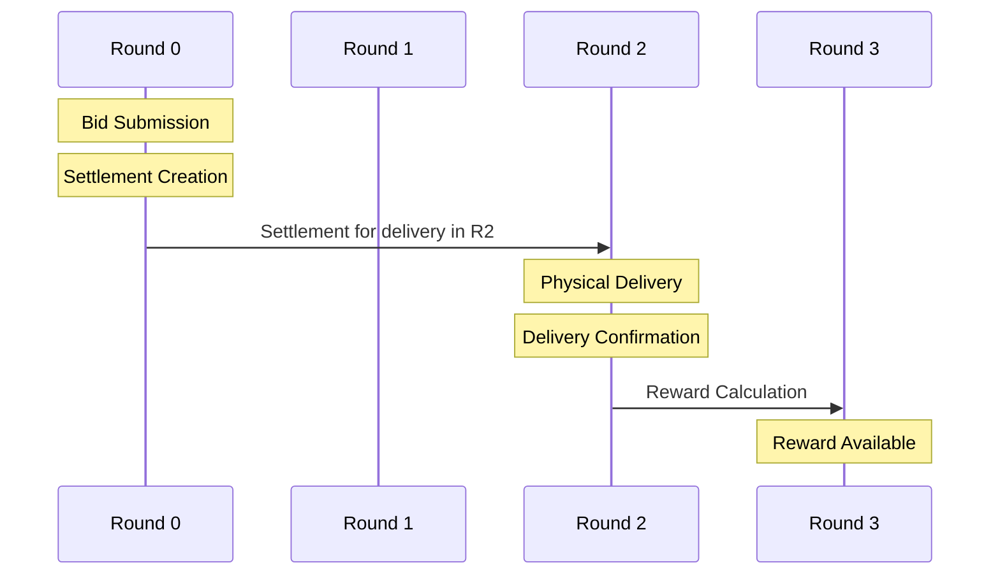
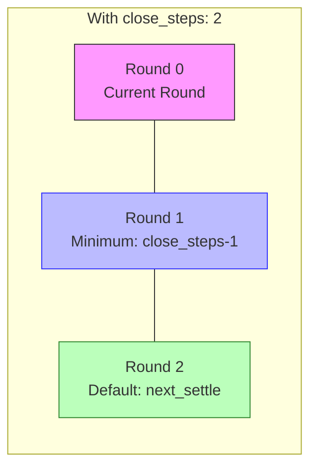
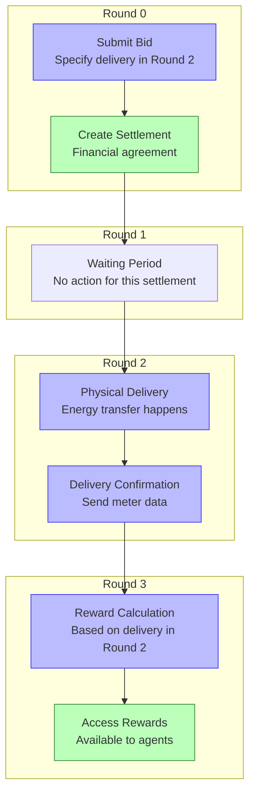

# TREX-Core Time Dynamics: Definitive Reference

## Executive Summary

This document provides a definitive explanation of how time flows in TREX-Core, particularly focusing on the relationships between rounds, settlements, deliveries, and rewards. Understanding these temporal relationships is critical for anyone working with or modifying the TREX-Core system.

## Core Time Concepts

| Term | Definition | Code Reference |
|------|------------|----------------|
| **Round** | A discrete time step in the simulation | `self.__timing['current_round']` |
| **Settlement** | The financial agreement between participants | Created at end of round in `DoubleAuction.py:settle()` |
| **Delivery** | The physical transfer of energy | Occurs during the round specified as `time_delivery` |
| **Reward** | Performance metric calculated after delivery | Calculated based on `last_deliver` in `net_profit.py` |
| **close_steps** | Parameter controlling minimum delivery time | Set in config, e.g., `"close_steps": 2` |

## Time Progression Visualization



## How `close_steps` Works

The `close_steps` parameter determines the minimum future round for which bids/asks can be placed:



When `close_steps` is set to 2:
- Minimum delivery round = current_round + (close_steps - 1) = Round 1
- Default delivery round = current_round + close_steps = Round 2

## Delivery Time Specification

The TREX-Core system allows participants to specify custom delivery times, but the standard trader implementations always use the default `next_settle`:

```python
# From participants/base.py - Shows optional time_delivery parameter
async def bid(self, time_delivery=None, **kwargs):
    if time_delivery is None:
        time_delivery = self.__timing['next_settle']
```

```python
# From basic_trader.py - Always uses next_settle for delivery time
actions['bids'] = {
    str(next_settle): {
        'quantity': residual_load,
        'price': self.bid_price
    }
}
```

## Actual Time Flow (With close_steps: 2)



## Generalized Formula

For a bid placed in Round X with `close_steps: Y`:
- Settlement Creation Round = X (end of round)
- Minimum Possible Delivery Round = X + (Y - 1)
- Default Delivery Round = X + Y (when using `next_settle`)
- Reward Calculation Round = Delivery Round + 1

## Code Evidence: Time Definition

```python
# From DoubleAuction.py - Defining time intervals
self.__timing.update({
    'current_round': (start_time, start_time + duration),
    'last_settle': (start_time + duration * (self.__timing['close_steps'] - 1),
                   start_time + duration * self.__timing['close_steps']),
    'next_settle': (start_time + duration * self.__timing['close_steps'],
                   start_time + duration * (self.__timing['close_steps'] + 1))
})
```

## Code Evidence: Settlement Creation

```python
# From DoubleAuction.py - Settlement happens at current round end
async def settle(self, bid: dict, ask: dict, time_delivery: tuple):
    # ...
    settlement_time = self.__timing['current_round'][1]  # End of current round
    # ...
    self.__settled[time_delivery][commit_id] = {
        'time_settlement': settlement_time,
        # ...
    }
```

## Code Evidence: Delivery Handling

```python
# From DoubleAuction.py - Meter data received for specific delivery time
async def meter_data(self, message):
    participant_id = message[0]
    time_delivery = tuple(message[1])  # The delivery time
    meter = message[2]
    # ... process delivery data
```

## Code Evidence: Reward Calculation

```python
# From net_profit.py - Rewards based on last_deliver
async def calculate(self, last_deliver=None, market_transactions=None, ...):
    if not last_deliver:
        if 'last_deliver' not in self.__timing:
            return 0.0
        else:
            last_deliver = self.__timing['last_deliver']
    # ... calculate reward based on completed delivery
```

## Example: Full Timeline with close_steps: 2

1. **Round 0**:
   - Trader submits bid with delivery time = Round 2
   - At end of Round 0, settlement is created (financial only)
   - Settlement record includes: buyer, seller, quantity, price, delivery time (Round 2)

2. **Round 1**:
   - No activity related to this specific settlement

3. **Round 2**:
   - Physical energy delivery occurs
   - At end of Round 2, participant sends:
     - Meter data showing actual energy transfer
     - Settlement delivery confirmation

4. **Round 3**:
   - At beginning of Round 3, rewards are calculated based on delivery in Round 2
   - Trader can access reward information

## Common Questions

### Q: When do I get rewards for a bid placed in Round 0?
**A**: You get rewards in Round (Delivery_Round + 1). With the default trader implementation and `close_steps: 2`, bids in Round 0 specify delivery in Round 2, so rewards are available in Round 3.

### Q: Can I bid for delivery in rounds other than the default next_settle?
**A**: Yes, theoretically. The code allows for custom delivery times, but the trader implementations in the codebase always use the default `next_settle`.

### Q: Does close_steps affect when settlement happens?
**A**: No. Settlement always happens at the end of the round when the bid is submitted. The `close_steps` parameter only affects the minimum and default delivery times.

## Conclusion

The time flow in TREX-Core follows a consistent pattern where:
1. Bids specify future delivery times (default = current_round + close_steps)
2. Settlements are created at the end of the current round
3. Delivery happens in the specified future round
4. Rewards are calculated in the round after delivery

This document provides definitive answers to avoid repeated analysis of these temporal relationships. 