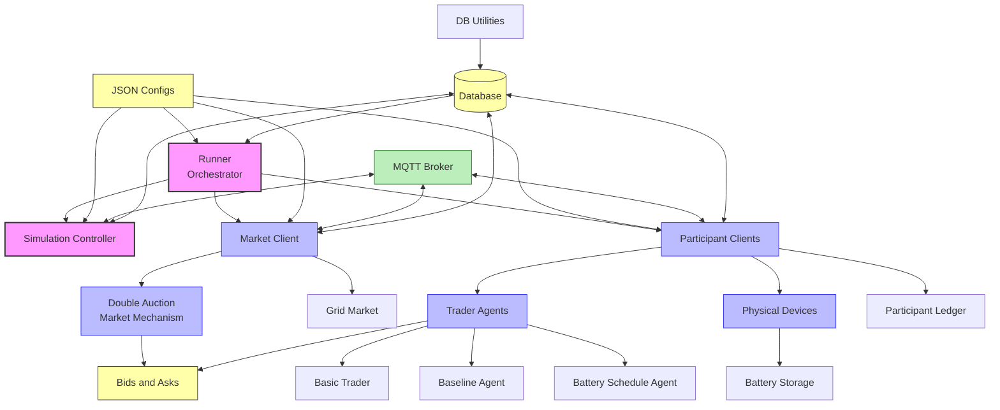
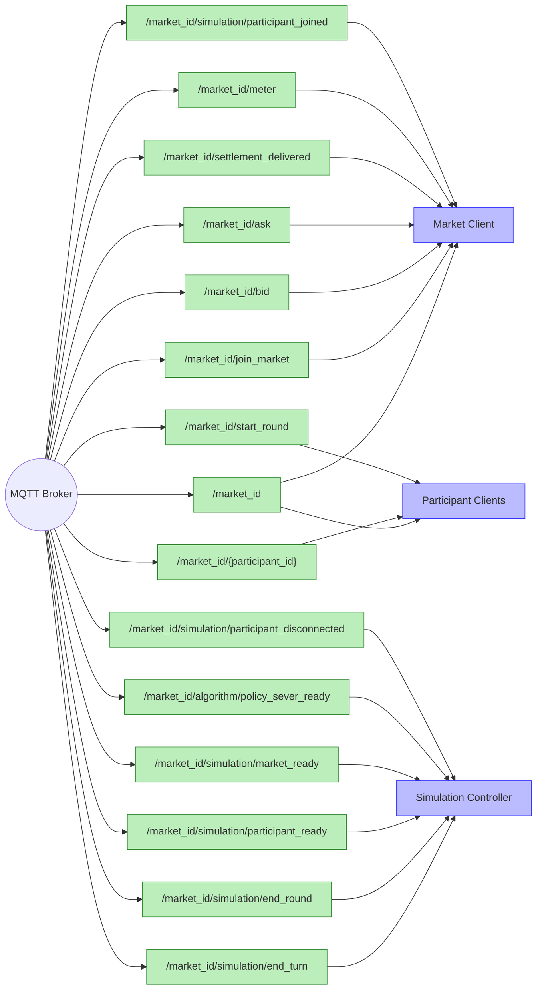
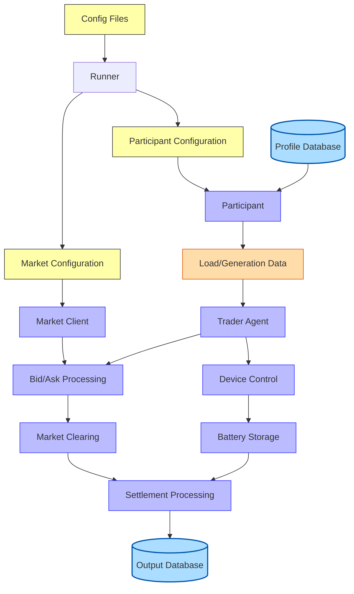
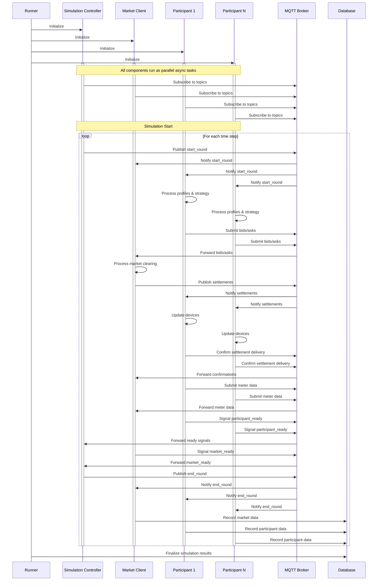
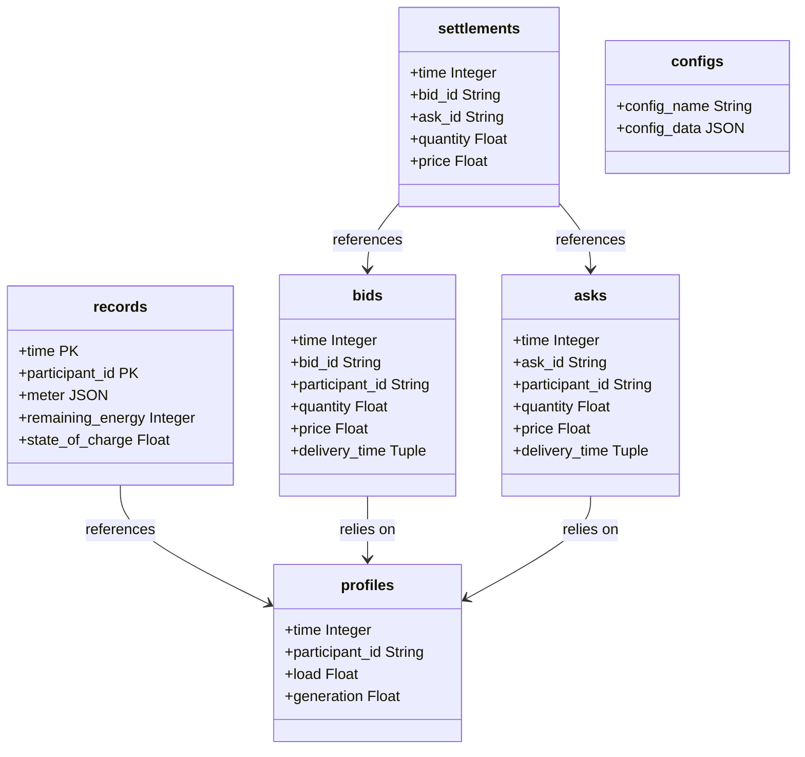
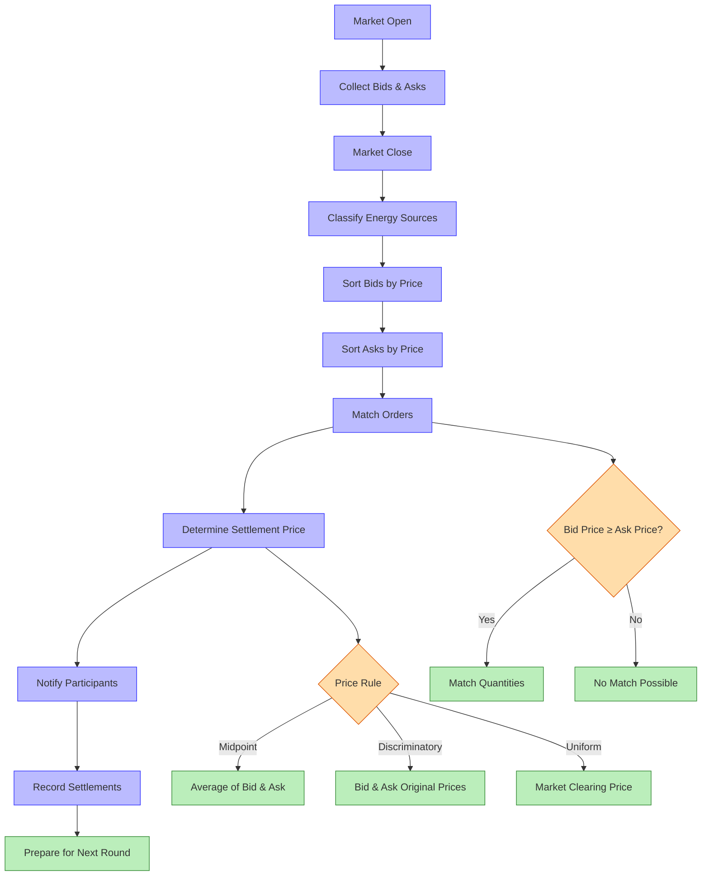
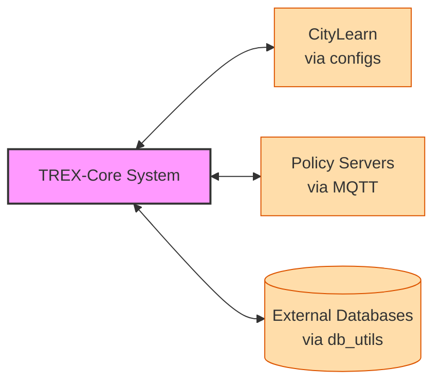

# TREX-Core Comprehensive Dependency Graph

This document visualizes the complete architecture, dependencies, and interactions within the TREX-Core Transactive Energy simulation framework.

## Core Components and Dependencies



## MQTT Communication Pathways



## Data Flow Pathways



## Execution Flow and Concurrency Model



## Database Schema and Relationships



## Double Auction Market Mechanism



## MQTT Message Sequence (Time-Based)

```mermaid
sequenceDiagram
    participant Runner
    participant SimController as Simulation Controller
    participant Market as Market Client
    participant Participant as Participants
    participant MQTT as MQTT Broker
    
    Note over Runner,MQTT: 1. Simulation Initialization
    Runner->>SimController: Start simulation
    SimController->>MQTT: Connect
    Market->>MQTT: Connect
    Participant->>MQTT: Connect
    
    Note over Runner,MQTT: 2. Market Round Start
    SimController->>MQTT: Publish /market_id/start_round
    MQTT->>Market: Forward start_round
    MQTT->>Participant: Forward start_round
    
    Note over Runner,MQTT: 3. Participant Actions
    Participant->>MQTT: Publish /market_id/bid
    Participant->>MQTT: Publish /market_id/ask
    MQTT->>Market: Forward bids
    MQTT->>Market: Forward asks
    
    Note over Runner,MQTT: 4. Market Clearing (Internal)
    Market->>Market: Process bids/asks
    Market->>Market: Determine matches
    
    Note over Runner,MQTT: 5. Settlement Notification
    Market->>MQTT: Publish /market_id/{participant_id}
    MQTT->>Participant: Forward settlements
    
    Note over Runner,MQTT: 6. Settlement Delivery Confirmation
    Participant->>MQTT: Publish /market_id/settlement_delivered
    MQTT->>Market: Forward confirmations
    
    Note over Runner,MQTT: 7. Meter Data Submission
    Participant->>MQTT: Publish /market_id/meter
    MQTT->>Market: Forward meter data
    
    Note over Runner,MQTT: 8. Round End Signal
    Market->>MQTT: Publish /market_id/simulation/market_ready
    MQTT->>SimController: Forward market_ready
    
    Note over Runner,MQTT: 9. Participant Status Updates
    Participant->>MQTT: Publish /market_id/simulation/participant_ready
    MQTT->>SimController: Forward participant_ready
    
    Note over Runner,MQTT: 10. Advance to Next Round
    SimController->>MQTT: Publish /market_id/simulation/end_round
    MQTT->>Market: Forward end_round
    MQTT->>Participant: Forward end_round
```

## Integration with External Systems

